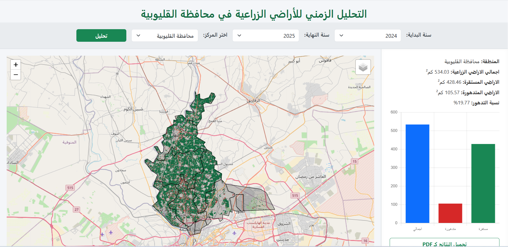
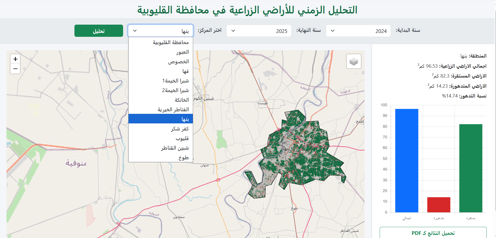

# Agricultural-Land-Degradation-Monitoring-System-for-Al-Qalyubiyah-2018-2025-
This project is a web-based Geospatial Monitoring System designed to detect and analyze agricultural land degradation across Al-Qalyubiyah Governorate, Egypt, using Sentinel-2 satellite imagery and vegetation indices (NDVI/EVI) over an eight-year period (2018–2025).  
The system enables decision-makers, agricultural planners, and environmental authorities to  monitor vegetation health trends, identify degraded zones, and support data-driven land management.

🚀 Key Features
- Governorate-Level Monitoring: Analyze agricultural degradation across Al-Qalyubiyah as a whole.

- District-Level Selection: Users can choose a specific district to perform focused analysis.
  
- Sentinel-2 Time Series Processing (2018–2025).
- Vegetation Health Classification: Automatically categorizes land as:
  - ✅ Stable Agricultural Land
  - ⚠️ Degraded Areas
- Automated Area Calculation for both stable and degraded zones.

🌐 System Interface (Arabic)
The web interface is designed in Arabic for usability by local authorities in Egypt
